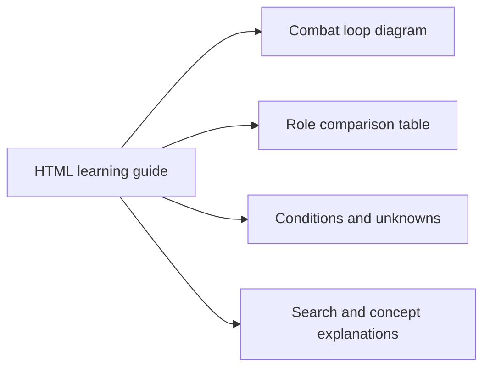

# Exile Architect

[English](README.md) · [简体中文](README.zh-CN.md)

Tools and agent skills for researching, creating, and understanding **Path of Exile 2 builds**. Research extracts reusable knowledge into a local database; Create uses that knowledge and Headless Path of Building to develop a build; Learn explains an existing build in an HTML guide.

Your agent host, such as Codex or Claude Code, performs the analysis and makes design decisions. This repository supplies local MCP tools, game data queries, persistent memory, and PoB checks. It does not include its own model or train one.

**This product isn't affiliated with or endorsed by Grinding Gear Games in any way.**

## What you can do

| Workflow | Input | Result |
| --- | --- | --- |
| **Research** · `poe-bd-research` | Existing builds from poe.ninja or local PoB files, with source version information | Structured observations about mechanics, synergies, conditions, and failure cases; accepted knowledge is stored locally for later retrieval |
| **Create** · `poe-bd-create` | Target level, class, skill, or build goal | An agent-designed build, PoB checks, and local PoB files; optional poe.ninja sharing when requested |
| **Learn** · `poe-bd-learn` | One existing build | A self-contained HTML guide with explanations, mechanism diagrams, comparison tables, and component details; no knowledge-base writes |

Create produces a **single build at the requested level**, usually for endgame. It does not currently deliver a complete leveling progression. Matching Research knowledge guides the design; when none is available, the agent uses game data, mechanics, and other permitted evidence and reports the knowledge gap.

`poe-bd-learning-loop` is a separate, experimental comparative workflow: analyze a reference, independently create a build in the same skill family at the same level, compare them, and retain reviewed lessons. It is not the Learn guide and does not establish that generated builds improve over time.

## Output examples

The excerpts below illustrate **output structure**, not a real player's build, a completed research run, or a performance benchmark.

### Research → local knowledge

```text
Observation: a damage setup depends on maintaining a triggering condition.
Conditions: record how the condition starts, persists, and recovers after interruption.
Failure case: check whether the setup still works against a boss without adds.
Evidence: keep source version, component identities, and verification status.
Reuse: retrieve this observation when designing the same skill family.
```

Research retains explanations and their evidence boundaries. Temporary third-party build material is kept separate from durable knowledge.

### Create → build files and an explanation

```text
Target: requested class, skill, and level
Design: skill groups, equipment roles, passive choices, and combat setup
Checks: PoB observations, deterministic legality checks, and model gaps
Delivery: local PoB XML/import code, with a summary and remaining caveats
```

An output can remain a **candidate requiring verification** when the model cannot cover a relevant mechanic. A PoB result is not an in-game performance guarantee.

### Learn → an HTML reader

The downloadable demo uses the actual reader renderer with original demonstration text. It contains **no third-party build or game artwork** and is not a completed BD analysis. Real guides add exact component icons when available.



[Download the English HTML demo](docs/examples/learning-guide-demo.en.html) and open it locally to try chapter search and clickable concept explanations. [中文演示](docs/examples/learning-guide-demo.zh-CN.html).

## Installation

### Requirements

- An agent host with MCP and skill support. Research also requires subagents that can access the Research MCP tools.
- Git, Python 3.11+, and [uv](https://docs.astral.sh/uv/).
- A working **Headless PathOfBuilding-PoE2 + LuaJIT** runtime for calculations. Source checkouts require the pinned upstream checkout and local patches described in [pob/PINNED.md](pob/PINNED.md); the installer does not provision this runtime.
- Node.js 20+ for optional official Build Planner `.build` conversion. The installer attempts provider preparation; this export requires a working provider.

Model access is provided by your agent host. Network access is needed for online collection and live references. Local storage does not mean that analysis bypasses your host's model service or its data policy.

### Install from a checkout

```bash
git clone https://github.com/avdergh/poe2-exile-architect.git
cd poe2-exile-architect
uv sync
```

Prepare the PoB runtime above, then select your host. These examples use Codex; replace `codex` with `claude`, `cursor`, or `opencode` as needed.

**Windows PowerShell**

```powershell
.\install.ps1 -FromCheckout codex
.\install.ps1 -FromCheckout -Doctor codex
```

**macOS / Linux**

```bash
bash install.sh --from-checkout codex
bash install.sh --doctor codex
```

Restart the host after installation. Ask it to load a skill and call `engine_health` to check the calculation runtime. For supported hosts, doctor checks configuration bindings; Codex directs you to verify through a new task and `engine_health`. Neither replaces an end-to-end generation check.

The installer links skills and registers four local MCP servers: `poe_knowledge_mcp`, `poe_build_mcp`, `poe_research_mcp`, and `poe_learning_mcp`. Details, update/uninstall options, and troubleshooting are in the [installation guide (Chinese)](docs/MULTI_AGENT_INSTALL.md).

### Host support

| Host | Current integration |
| --- | --- |
| Codex | Installer and MCP configuration; Research Controller/Worker, Create, Learn, and comparative Learning Loop. Desktop task orchestration is needed for the loop. |
| Claude Code / Cursor / OpenCode | Installer and MCP configuration; Research Controller/Worker, Create, and Learn. Research requires the host's subagent tool access. |
| DeepSeek Harness | Separate patch + preset with adapted skills; live host acceptance is still pending. See [DSH setup (Chinese)](dsh/README.md). |
| VS Code Copilot / Gemini / OpenClaw / Hermes | Skill linking only; manual MCP integration and validation required. |
| Pi | No maintained integration. |

macOS installation is provided but has not completed real-machine certification. Configuration support does not imply every workflow has been verified on every platform. The separate `poe-bd-research-loop` needs an external orchestrator and is excluded from the packaged Codex plugin.

## Usage

After installation, ask your agent directly. Slash-command availability varies by host.

**Create a build**

```text
Use poe-bd-create to create a level 90 Sorceress build around Spark.
Export local PoB files only. Explain the combat loop and any unverified mechanics.
```

For optional online sharing, explicitly ask for a poe.ninja share link as well. Build Planner `.build` export depends on converter availability. Outputs follow your request's language unless you specify another; unverified translations of game names retain the original names.

**Research your own build**

```text
Use poe-bd-research to analyze the attached PoB export and store reusable knowledge locally.
Its source game patch is [the actual patch of this build].
```

Supply the file and replace the patch placeholder. Automatic collection is also implemented: for example, “Use poe-bd-research to analyze 5 current-league builds.” Use it with the necessary source permissions; see [data use](#data-use-and-licensing). A dry run checks collection without producing knowledge.

**Understand an existing build**

```text
Use poe-bd-learn to explain the attached build for a new player.
Cover the combat loop, skill and equipment roles, defenses, and failure conditions.
Deliver an English HTML learning guide.
```

## Local data and limitations

- Research memory and comparative learning memory persist in the OS user-data directory. `POE2_MCP_DATA` overrides the location. Learn reads knowledge but does not add Research or comparative learning records.
- Raw third-party inputs use temporary quarantine storage and follow cleanup/retention rules. Local user data and exported builds should not be committed to Git.
- The checkout currently includes Research/Learning seeds and a game corpus. These are separate release materials with unresolved licensing review; see below.
- PoB coverage varies by mechanic and version. Reports distinguish measured values, assumptions, rough estimates, and unknowns. Default Judge feedback focuses on deterministic failures; strict feedback is optional.
- Results depend on source quality, model coverage, and the agent's decisions. The project does not promise optimal builds, guaranteed boss kills, or affordable equipment.

## Data use and licensing

Much of the mature-build research uses **poe.ninja**. Its [Terms of Service](https://poe.ninja/terms) restrict copying, public display, and redistribution; public accessibility is not a redistribution license. Internal copy-safety checks reduce copied-content exposure but do not grant permission. **The bundled data has not been cleared for unrestricted public redistribution.** See the [pre-publication risk assessment (Chinese)](docs/DATA_RIGHTS_REVIEW.md) for the tracked data inventory and follow-up.

Use sources you are entitled to process. Third-party game data, artwork, build material, and derived datasets do not automatically inherit the [MIT code license](LICENSE). GGG's [third-party policy](https://www.pathofexile.com/developer/docs) and [terms](https://www.pathofexile.com/legal/terms-of-use-and-privacy-policy) also apply where relevant.

This project builds on [MaxWilk/poe2-build-mcp](https://github.com/MaxWilk/poe2-build-mcp) and [PathOfBuildingCommunity/PathOfBuilding-PoE2](https://github.com/PathOfBuildingCommunity/PathOfBuilding-PoE2). Preserve their license notices and the [converter provider's notice](providers/poe2-build-converter/UPSTREAM_LICENSE.txt) when redistributing their code.

## Development and documentation

- [Architecture](docs/ARCHITECTURE.md) / [架构（中文）](docs/ARCHITECTURE.CN.md)
- [Project specification](docs/PROJECT_SPEC.md), [data contracts](docs/SCHEMAS.md), and [phase documentation](docs/phases/) — Chinese
- [Create skill](poe-bd-creator-plugin/skills/poe-bd-create/SKILL.md), [Research skill](poe-bd-creator-plugin/skills/poe-bd-research/SKILL.md), and [Learn skill](poe-bd-creator-plugin/skills/poe-bd-learn/SKILL.md)
- [Contributor instructions](AGENTS.md) and [verification profiles](scripts/verify.ps1)

Keep user exports and third-party raw inputs out of contributions. Include relevant tests and version/model evidence when changing calculation or data behavior.
