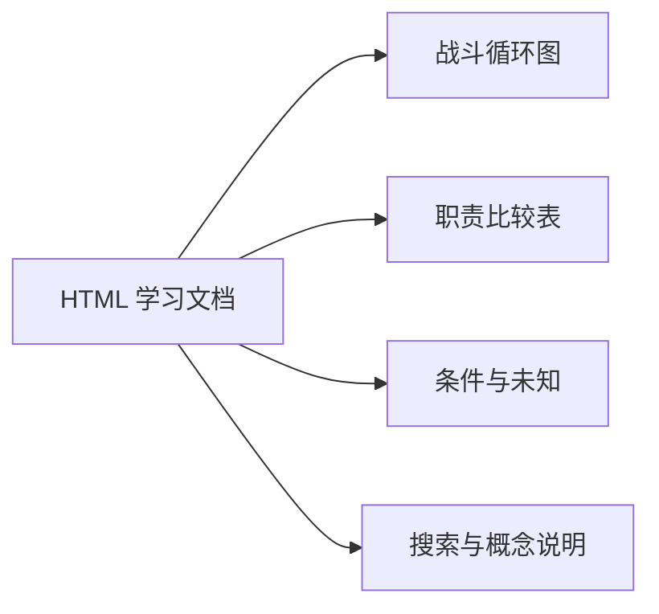

# Exile Architect

[English](README.md) · [简体中文](README.zh-CN.md)

用于研究、创建和理解 **Path of Exile 2 构筑（BD）** 的工具与 Agent skills。Research 从已有 BD 中提取可复用知识，存入本地知识库；Create 结合知识与 Headless Path of Building 设计构筑；Learn 把一个已有 BD 解释成 HTML 学习文档。

Codex、Claude Code 等 Agent 宿主负责分析和设计决策。本仓库提供本地 MCP 工具、游戏资料查询、持久记忆和 PoB 检查，不内置模型，也不训练模型。

**本项目与 Grinding Gear Games 无关联，亦未获得其背书。**

## 能做什么

| 工作流 | 输入 | 产出 |
| --- | --- | --- |
| **Research** · `poe-bd-research` | poe.ninja 或本地 PoB 中的已有 BD，以及来源版本信息 | 关于机制、组件配合、成立条件和失败场景的结构化观察；通过验收的知识存入本地，供后续查询 |
| **Create** · `poe-bd-create` | 目标等级、职业、技能或构筑目标 | Agent 设计的构筑、PoB 检查和本地 PoB 文件；按用户要求可额外生成 poe.ninja 分享链接 |
| **Learn** · `poe-bd-learn` | 一个已有 BD | 单文件 HTML 学习文档，包含讲解、机制图、比较表和组件说明；不写入知识库 |

Create 直接生成**用户请求等级的单阶段 BD**，通常用于终局，当前不提供完整开荒成长路线。有匹配的 Research 知识时，以其指导设计；没有命中时，使用游戏资料、机制与其他允许的证据，并说明知识缺口。

`poe-bd-learning-loop` 是另一个实验性对照流程：研究参考 BD，独立生成同技能流派、同等级的 BD，再比较并保存经过审核的经验。它与 Learn 学习文档不同，也不证明生成能力已经随案例积累而提升。

## 效果展示

以下片段是**输出结构示意**，不是某个玩家的 BD、真实研究完成记录或性能测试结果。

### Research → 本地知识

```text
观察：一套输出组合依赖持续维持某个触发条件。
成立条件：记录该条件如何启动、维持，以及中断后如何恢复。
失败场景：检查没有小怪的 Boss 战中能否继续运转。
证据：保留来源版本、组件身份和验证状态。
复用：后续设计同技能流派时，检索这条观察。
```

Research 保存解释及其证据边界。临时第三方构筑原料与长期知识分开管理。

### Create → 构筑文件与说明

```text
目标：用户要求的职业、技能与等级
设计：技能组、装备职责、天赋选择与战斗配置
检查：PoB 观察、确定性合法性检查、模型缺口
交付：本地 PoB XML / 导入码，以及摘要和待验证事项
```

相关机制超出模型覆盖时，产物可能保持为**待验证候选**。PoB 结果不等于游戏内表现保证。

### Learn → HTML 阅读页

可下载演示使用项目实际阅读器渲染原创文本，**不含第三方 BD 或游戏美术**，不代表已完成一次 BD 分析。实际学习文档在资源可用时附带精确组件图标。



[下载中文 HTML 演示](docs/examples/learning-guide-demo.zh-CN.html)，在本地打开即可体验章节搜索和概念点击说明。[English demo](docs/examples/learning-guide-demo.en.html)。

## 安装

### 前置条件

- 支持 MCP 和 skills 的 Agent 宿主。Research 还要求子代理能访问 Research MCP 工具。
- Git、Python 3.11+ 和 [uv](https://docs.astral.sh/uv/)。
- 数值计算需要可用的 **Headless PathOfBuilding-PoE2 + LuaJIT** 运行时。源码 checkout 需按 [pob/PINNED.md](pob/PINNED.md) 准备固定版本的上游源码与本地补丁；安装器不负责配置此运行时。
- 可选的官方 Build Planner `.build` 转换需要 Node.js 20+。安装器会尝试准备转换 provider；导出此格式须有可用 provider。

模型访问由 Agent 宿主提供。在线采集和实时资料查询需要联网。本地存储不表示分析过程绕过宿主的模型服务或数据政策。

### 从源码安装

```bash
git clone https://github.com/avdergh/poe2-exile-architect.git
cd poe2-exile-architect
uv sync
```

准备好上述 PoB 运行时后，选择宿主。以下以 Codex 为例，也可以把 `codex` 替换为 `claude`、`cursor` 或 `opencode`。

**Windows PowerShell**

```powershell
.\install.ps1 -FromCheckout codex
.\install.ps1 -FromCheckout -Doctor codex
```

**macOS / Linux**

```bash
bash install.sh --from-checkout codex
bash install.sh --doctor codex
```

安装后重启宿主，要求 Agent 加载 skill，并调用 `engine_health` 检查计算运行时。doctor 在支持的宿主上检查配置绑定；Codex 的该入口会提示通过新任务与 `engine_health` 验证。这些检查均不等于端到端 BD 生成验收。

安装器会链接 skills，并注册四个本地 MCP server：`poe_knowledge_mcp`、`poe_build_mcp`、`poe_research_mcp` 和 `poe_learning_mcp`。详细配置、更新/卸载选项与排错见[安装指南](docs/MULTI_AGENT_INSTALL.md)。

### 宿主支持情况

| 宿主 | 当前接入情况 |
| --- | --- |
| Codex | 安装器及 MCP 配置；Research Controller/Worker、Create、Learn、对照 Learning Loop。Loop 需要 Desktop 任务编排能力。 |
| Claude Code / Cursor / OpenCode | 安装器及 MCP 配置；Research Controller/Worker、Create、Learn。Research 依赖宿主对子代理工具访问的支持。 |
| DeepSeek Harness | 独立 patch + preset 适配及改写 skills；真实宿主验收仍待完成。见 [DSH 安装说明](dsh/README.md)。 |
| VS Code Copilot / Gemini / OpenClaw / Hermes | 仅链接 skills，需手动接入 MCP 并验证。 |
| Pi | 暂无维护中的适配。 |

macOS 提供安装路径，但尚未完成实机认证。支持配置不等于每个工作流都已在每个平台验证。另一个 `poe-bd-research-loop` 依赖外部 orchestrator，当前 Codex 插件打包时会排除它。

## 使用方式

安装后直接向 Agent 描述需求即可。不同宿主的斜杠命令发现方式不同。

**创建 BD**

```text
使用 poe-bd-create，以 Spark 为核心创建一个 90 级 Sorceress BD。
只导出本地 PoB 文件，解释战斗循环和未验证机制。
```

需要在线分享时，明确追加“同时生成 poe.ninja 分享链接”。Build Planner `.build` 导出取决于转换器是否可用。输出语言跟随用户请求，除非用户明确指定另一种语言；未核实译名的游戏专名保留原名。

**研究自己的 BD**

```text
使用 poe-bd-research，分析我附带的 PoB 导出，把可复用知识存入本地。
这个 BD 的来源游戏版本是［该构筑的实际补丁号］。
```

附上文件并替换版本占位。项目也实现了自动采集，例如“使用 poe-bd-research，分析 5 个当前联盟的成熟 BD”；须在具备来源使用权限时使用，见[数据使用与许可](#数据使用与许可)。预检只验证采集链路，不产生知识。

**理解已有 BD**

```text
使用 poe-bd-learn，面向新手解释我附带的 BD。
讲清战斗循环、技能和装备职责、防御方式以及失效条件。
交付中文 HTML 学习文档。
```

## 本地数据与限制

- Research Memory 与对照 Learning Memory 持久保存在操作系统用户数据目录，可用 `POE2_MCP_DATA` 改位置。Learn 可以读取知识，但不新增 Research 或对照学习记录。
- 第三方原始输入进入临时隔离区，按清理和保留期限规则管理。本地用户数据与导出的 BD 不应提交 Git。
- 当前 checkout 随附 Research/Learning 种子与游戏语料库；这些是独立的发布材料，许可复核尚未完成，详见下节。
- PoB 对不同机制、版本的覆盖不同。报告区分实测值、假设、粗估与未知。Judge 默认只反馈确定性失败，严格反馈可选。
- 结果取决于来源质量、模型覆盖和 Agent 决策。项目不保证最优 BD、必过 Boss 或装备价格可负担。

## 数据使用与许可

成熟 BD 研究大量使用 **poe.ninja**。其[服务条款](https://poe.ninja/terms)限制复制、公开展示与再分发；公开可访问不等于取得再分发许可。内部 copy-safety 检查能减少复制内容暴露，但不授予使用权。**当前随附数据尚未完成不受限公开再分发的授权审查。** 已跟踪数据清单和后续事项见[发布前数据权利风险评估](docs/DATA_RIGHTS_REVIEW.md)。

请使用自己有权处理的来源。第三方游戏数据、美术、构筑材料及衍生数据集不会自动获得本仓库的 [MIT 代码许可](LICENSE)；相关使用还应遵守 GGG 的[第三方政策](https://www.pathofexile.com/developer/docs)与[服务条款](https://www.pathofexile.com/legal/terms-of-use-and-privacy-policy)。

本项目基于 [MaxWilk/poe2-build-mcp](https://github.com/MaxWilk/poe2-build-mcp) 和 [PathOfBuildingCommunity/PathOfBuilding-PoE2](https://github.com/PathOfBuildingCommunity/PathOfBuilding-PoE2) 开发。再分发其代码时须保留原许可声明，以及[转换 provider 的上游声明](providers/poe2-build-converter/UPSTREAM_LICENSE.txt)。

## 开发与文档

- [架构（中文）](docs/ARCHITECTURE.CN.md) / [Architecture](docs/ARCHITECTURE.md)
- [项目总纲](docs/PROJECT_SPEC.md)、[数据合同](docs/SCHEMAS.md)、[阶段文档](docs/phases/)（中文维护）
- [Create skill](poe-bd-creator-plugin/skills/poe-bd-create/SKILL.md)、[Research skill](poe-bd-creator-plugin/skills/poe-bd-research/SKILL.md)、[Learn skill](poe-bd-creator-plugin/skills/poe-bd-learn/SKILL.md)
- [贡献者指南](AGENTS.md)与[验证分层](scripts/verify.ps1)

提交贡献时不要附带用户导出或第三方原料。修改计算或数据行为时，应附相关测试及版本、模型证据。
