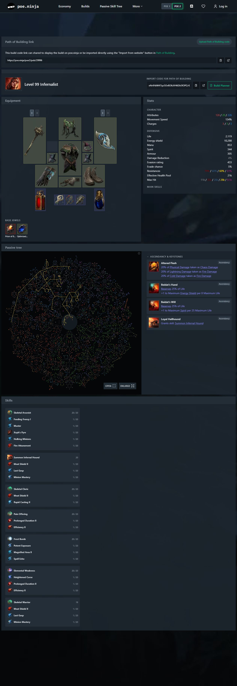

# Exile Architect

[English](README.md) · [简体中文](README.zh-CN.md)

[](LICENSE)
[](pyproject.toml)
[](#安装)

**让 AI Agent 帮你研究、创建和理解 Path of Exile 2 构筑（BD）。**

Exile Architect 为 Codex、Claude Code、Cursor、OpenCode 和 DeepSeek Harness 接入《流放之路 2》游戏资料、本地构筑知识库与 Headless Path of Building（PoB）。Agent 负责分析和设计，PoB 负责数值计算与构筑检查。

[安装](#安装) · [使用方式](#使用方式) · [案例展示](#案例展示) · [常见问题](#常见问题) · [反馈与贡献](#反馈与贡献)

## 为什么选择 Exile Architect

- **数值来自 PoB，而不是来自模型。** 所有计算都通过固定版本的 headless Path of Building 执行；引擎无法建模的部分会标注为粗估或未知项，不会冒充引擎结果。
- **知识库属于你，并且会持续积累。** 通过验收的研究结论保存在本机，后续会话仍可检索，Create 依据你收集到的证据设计，而不是只靠模型记忆。
- **完全本地运行。** 不需要注册托管服务，也不需要额外的模型账号：工具从你自己的项目目录运行，使用 Agent 宿主已经配置好的模型。
- **三种工作流，同一套工具链。** Research、Create、Learning 共享同一份游戏资料、知识库与计算引擎，并且都可以独立使用。

## 三种工作流

| 我想做什么 | 使用哪个功能 | 会得到什么 |
| --- | --- | --- |
| 从已有 BD 中积累可复用的知识 | **Research · 研究** · `poe-bd-research` | 保存机制、组件配合、成立条件与失败场景，供后续构筑设计检索 |
| 按职业、技能和目标等级设计一个 BD | **Create · 创建** · `poe-bd-create` | 技能、装备与天赋方案，PoB 检查，本地构筑文件与玩法说明 |
| 看懂一个已有 BD，知道怎样使用它 | **Learning · 学习** · `poe-bd-learn` | 带组件图标、战斗循环图、详细讲解、目录与搜索的 HTML 学习指南 |

**Research 积累知识，Create 利用知识设计构筑，Learning 帮玩家读懂构筑而不写入知识库。** 三种功能可以独立使用。

## 积累自己的构筑知识库

把感兴趣的 BD 交给 Research，逐步建立自己的本地知识库。研究会保存技能配合、装备职责、天赋选择、资源恢复与防御机制，以及它们的成立条件、失效场景和适用版本。通过验收的结论保留在本机，后续会话可以继续检索。

创建新 BD 时，Create 会查找与职业、技能和目标版本相关的研究，由 Agent 据此选择方案、按目标等级搭建构筑，再用 PoB 检查。研究自己常玩的流派，可以为后续创建积累机制依据和搭配选择。

例如，先研究几套 Spark BD，再让 Create 参考本地研究设计一个 90 级 Spark BD。已有知识用于指导新方案，装备、资源需求和计算结果会针对新构筑重新检查；缺少证据或尚未建模的部分会在结果中说明。

## 安装

Exile Architect 通过源码目录安装，Agent 会从这个目录启动工具，安装后请保留该目录。

### 1. 准备环境

- 安装 [Git](https://git-scm.com/downloads) 和 [uv](https://docs.astral.sh/uv/getting-started/installation/)。uv 可以自动安装所需的 Python 版本。
- 准备一个已经配置好模型的宿主：**Codex、Claude Code、Cursor、OpenCode 或 DeepSeek Harness**。Research 还需要宿主允许子代理访问 MCP 工具。
- 安装运行 PoB 计算引擎所需的 **LuaJIT 2.1**：

| 系统 | LuaJIT 安装方式 |
| --- | --- |
| Windows | 安装 [MSYS2](https://www.msys2.org/)，打开它的 **UCRT64** 终端，运行 `pacman -S mingw-w64-ucrt-x86_64-luajit`。程序会自动识别标准位置 `C:\msys64\ucrt64\bin\luajit.exe`。 |
| macOS | 已安装 Homebrew 时，运行 [`brew install luajit`](https://formulae.brew.sh/formula/luajit)。 |
| Ubuntu / Debian | 依次运行 `sudo apt-get update` 和 `sudo apt-get install luajit`。 |

LuaJIT 安装在其他位置时，在 Agent 宿主使用的环境中把 `POB_LUAJIT` 设为可执行文件的绝对路径。Node.js 20+ 是可选依赖，用于导出 Build Planner `.build` 文件。

### 2. 下载项目和 PoB

Windows 使用 PowerShell，macOS / Linux 使用终端，依次运行：

```sh
git clone https://github.com/avdergh/poe2-exile-architect.git
cd poe2-exile-architect
uv sync --python 3.12

git clone --filter=blob:none --no-checkout https://github.com/PathOfBuildingCommunity/PathOfBuilding-PoE2.git pob/PathOfBuilding-PoE2
git -C pob/PathOfBuilding-PoE2 config core.autocrlf false
git -C pob/PathOfBuilding-PoE2 checkout ce566eac45ea8a86477f513c7ee65a1ebe60014e
```

请使用这个固定 PoB 版本，并应用下一步的补丁。仅安装 PoB 桌面软件不能替代这里的 headless 运行时。

### 3. 应用补丁并接入 Agent

选择对应系统的命令。以下以 Codex 为例；使用其他宿主时，将 `codex` 替换为 `claude`、`cursor` 或 `opencode`。DeepSeek Harness 通过独立的 preset 安装，见本步骤末尾。

**Windows PowerShell**

```powershell
Get-ChildItem .\pob\patches\*.patch | Sort-Object Name | ForEach-Object {
    git -C pob/PathOfBuilding-PoE2 apply --ignore-whitespace $_.FullName
    if ($LASTEXITCODE -ne 0) { throw "PoB patch failed: $($_.Name)" }
}
.\install.ps1 -FromCheckout codex
```

**macOS / Linux**

```sh
(cd pob/PathOfBuilding-PoE2 && git apply --ignore-whitespace ../patches/*.patch)
bash install.sh --from-checkout codex
```

补丁只需在新下载的 PoB 源码上应用一次。安装器会注册四个本地 MCP 服务并安装工作流 skills。Windows 是主要开发平台；macOS 尚未完成实机认证。

**DeepSeek Harness**

DeepSeek Harness 原生带 MCP client，所以 Exile Architect 以 Agent preset 而不是宿主配置的形式安装。请先完成上面第 1、2 步：四个 MCP 服务启动的是同一个 headless PoB 引擎，需要固定版 PoB 源码、补丁和 LuaJIT。

```powershell
.\install.ps1 -FromCheckout dsh
```

```sh
bash install.sh --from-checkout dsh
```

安装器会把 `poe-bd` preset 放到 `${DSH_HOME:-$HOME/.dsh}/.agent-presets/poe-bd`，其中已经写入你的项目路径，并在旁边生成一份填好路径的 layer-1 MCP patch。启动 DSH 后新建会话并选择 **poe-bd**，然后让它调用 `engine_health`。`.\install.ps1 -Doctor dsh`（或 `bash install.sh --doctor dsh`）可检查已放置的 preset。

注册方式二选一：用 preset，或用 `dsh web --patch <preset 目录>/poe-bd.mcp.cordis.yml` 把服务注册到所有会话。两者同时使用会让同一个 server 拉起两套实例（两个 PoB 引擎），并让工具对所有会话可见。DeepSeek Harness 的真实宿主验收尚未完成，细节与已知边界见 [DSH 安装说明](dsh/README.md)。

### 4. 检查是否安装成功

重启 Agent 宿主，打开一个新会话，发送：

```text
检查 Exile Architect 工具是否可用，调用 engine_health，
然后确认可以使用 poe-bd-research、poe-bd-create 和 poe-bd-learn。
```

`engine_health` 只观察进程和工具活动，不启动或重置 PoB。首次计算前的 `not_started` 属于正常状态，`busy` 表示任务仍在运行；两者都不认证构筑，也不要求执行 `new_build`。工具或引擎缺失时，见[疑难排查](#疑难排查)。

## 使用方式

把下面的请求**发送到 Agent 对话中**，需要已有 BD 时附上文件。这些是使用示例，不是终端命令；也可以通过宿主的 skill 菜单选择对应功能。

### Research：把已有 BD 研究成知识

从 PoB 导出构筑的导入码，保存为文本文件。请同时提供这个 BD 的实际游戏版本，便于正确记录知识适用范围。

```text
使用 /poe-bd-research 研究附件 my-build.txt。
这个 BD 的游戏版本是［该构筑的实际补丁号］。
分析核心机制、必需的组件配合和失效条件，
把可复用的研究结论保存到本地知识库。
```

Research 会分析构筑、核对证据，再保存通过验收的知识。后续 Create 可以检索这些知识；你会收到研究成果与待验证问题的摘要。

### Create：设计一个 BD

```text
使用 /poe-bd-create，以 Spark 为核心创建一个 90 级 Sorceress BD。
参考本地知识库中的相关研究来设计。
目标是终局刷图和 Boss。讲清技能组合、装备、天赋与战斗循环，
并导出本地 PoB 文件。
```

Create 直接设计**一个目标等级的 BD**，使用 PoB 检查并解释结果，不需要先提供参考构筑。有匹配的 Research 知识时会用于指导设计；知识不足或机制未建模的部分会在结果中说明。

### Learning：学会理解和使用一个 BD

```text
使用 /poe-bd-learn，面向新手讲解附件 my-build.txt。
先讲战斗循环，再解释技能、装备、天赋、资源恢复与防御层。
生成一份中文 HTML 学习指南。
```

用浏览器打开生成的 HTML 文件即可阅读。指南包含组件讲解、机制图与搜索，可以从头学习，也可以直接查某个部位。Learning 不写入 Research 知识，也不生成新的 BD。

辅助与镶嵌这类长耗时优化支持 `background=true`：工具先返回操作 ID，之后用 `get_compute_operation` 取回完整结果，无需重新搜索；`cancel_compute_operation` 会在安全计算边界请求取消。每个会话仍只运行一项计算，结果保留在当前服务进程，不支持跨重启恢复。执行结束与审计通过分别判断，最终辅助检查使用 `purpose="final_audit"`。

输出语言默认跟随你的请求，也可以明确指定其他语言。

## 案例展示

下面是上述工作流的真实产物。每个案例都附有说明，区分 PoB 已验证的部分与仍需验证的部分。

### Learning 案例：100 级 Gemling Legionnaire Twister 学习指南

[英文介绍](examples/learning-twister.en.md) · [完整 14 章正文](examples/learning-twister.zh-CN.md) · [HTML 阅读版（ZIP）](examples/learning-twister.zh-CN.zip)

指南以 100 级 Gemling Legionnaire 为例，逐章讲解战斗循环、技能配合、装备与天赋选择。可以直接在 GitHub 上通读全文，也可以下载压缩包，解压后用浏览器打开 `Twister-learning-guide.html`，使用内嵌图标、搜索与交互式组件说明。

### Create 案例：99 级锐眼冰箭

[案例说明](examples/create-latest.zh-CN.md) · [poe.ninja 构筑页](https://poe.ninja/poe2/pob/29726)

冰箭与双幻影配合冻结印记、狙击和龙卷风，使用包含猎首与 Lineage 辅助的成型交易装备。

[](https://poe.ninja/poe2/pob/29726)

本例展示 Create 的四种交付产物：

| 产物 | 用途 | 查看或下载 |
| --- | --- | --- |
| 完整 PoB XML | 查看和编辑技能、装备、天赋与配置 | [PoB 文件](examples/Deadeye_Ice_Shot_99.xml) |
| PoB 导入码 | 复制到 PoB 中快速导入 | [导入码](examples/Deadeye_Ice_Shot_99.pobcode.txt) |
| 官方 `.build` 文件 | 导入官方 Build Planner | [.build 文件](examples/Deadeye_Ice_Shot_99.build) |
| 在线分享页 | 浏览构筑并与他人分享 | [poe.ninja 页面](https://poe.ninja/poe2/pob/29726) |

主冰箭在 PoB 巅峰首领配置下约 12.62 万 DPS；双幻影等完整输出及部分恢复机制仍待验证。`.build` 的部分内容以说明文本呈现，完整配置以 PoB 为准，具体边界见[案例说明](examples/create-latest.zh-CN.md)。

### Create 案例（without-memory）：99 级 Infernalist

[poe.ninja 构筑页](https://poe.ninja/poe2/pob/29996)

这个 BD 以 **without-memory**（`--no-memory`）模式生成，未检索 Research 知识库或 Learning Memory。Agent 使用游戏资料与 PoB 工具设计，以 Skeletal Arsonist 为核心，搭配 Summon Infernal Hound 和 Skeletal Cleric。

下面的完整截图包含装备、属性、天赋树、升华与全部技能组，点击图片可在 poe.ninja 查看构筑。

[](https://poe.ninja/poe2/pob/29996)

## 常见问题

**支持哪些 Agent 宿主？**

Codex、Claude Code、Cursor 和 OpenCode 由安装器直接配置；DeepSeek Harness 以 Agent preset 形式安装。Research 还要求宿主允许子代理调用 MCP 工具。

**需要额外配置模型 API Key 吗？**

使用 Agent 宿主已经配置好的模型即可，Exile Architect 不另行运行模型服务。

**构筑和研究知识保存在哪里？**

默认保存在操作系统的本地用户数据目录 `poe2-build-mcp` 下。研究知识独立于对话保存，使用同一数据目录的新会话可以继续检索。可通过 `POE2_MCP_DATA` 指定其他位置，Agent 会返回生成文件的路径。

**能生成从开荒到终局的完整升级路线吗？**

Create 当前交付目标等级的构筑，不提供完整升级路线。Learning 负责讲解你提供的已有构筑。

**“待验证候选”是什么意思？**

部分机制或资源条件还需要验证。报告会区分 PoB 观察、粗估与未知项；通过检查不等于已经证实实战表现。

**`poe-bd-learning-loop` 也是学习指南吗？**

它是另一个实验性流程，用于比较参考构筑与独立生成的构筑，并记录经过审核的经验。想让 Agent 带你读懂一个 BD，请用 `poe-bd-learn`。

**怎样更新？**

在项目目录运行 `git pull --ff-only` 和 `uv sync`，重新运行对应宿主的安装命令并重启宿主。如果固定 PoB 版本发生变化，还需按 [pob/PINNED.md](pob/PINNED.md) 更新 headless 运行时。重新安装 DeepSeek Harness preset 时会把上一版保留为 `poe-bd.bak` 恢复点；再下一次安装会因此报冲突，需要加 `-Force` / `--force`，它会把该恢复点改名为带时间戳的目录而不是删除。

## 疑难排查

**找不到工具。** 检查宿主 MCP 配置中是否有 `poe_knowledge_mcp`、`poe_build_mcp`、`poe_research_mcp` 和 `poe_learning_mcp`，然后重启宿主并新建会话。DeepSeek Harness 中只有在使用 `poe-bd` preset 的会话里才会出现这些工具；`.\install.ps1 -Doctor dsh`（`bash install.sh --doctor dsh`）会报告已放置的 preset 是否完整。

**计算引擎无法启动。** 检查第 1、2 步的 LuaJIT 安装路径与固定版 PoB 源码（包括已应用的补丁）。`engine_health` 会报告引擎进程的当前状态；`POB_LUAJIT` 用于指定非标准位置的 LuaJIT。

## 反馈与贡献

[提交 Issue](https://github.com/avdergh/poe2-exile-architect/issues) 时，请提供宿主、操作系统、游戏版本、复现步骤和错误信息，不要附带凭据或私有构筑导出。提交代码改动时，请附上相关验证结果。

工作流说明：[Research](poe-bd-creator-plugin/skills/poe-bd-research/SKILL.md) · [Create](poe-bd-creator-plugin/skills/poe-bd-create/SKILL.md) · [Learning](poe-bd-creator-plugin/skills/poe-bd-learn/SKILL.md)。

## 许可与致谢

代码采用 [MIT 许可](LICENSE)。本项目基于 [poe2-build-mcp](https://github.com/MaxWilk/poe2-build-mcp) 和 [PathOfBuilding-PoE2](https://github.com/PathOfBuildingCommunity/PathOfBuilding-PoE2)，[转换 provider](providers/poe2-build-converter/UPSTREAM_LICENSE.txt) 保留其上游许可声明。第三方游戏数据和美术的权利归各自权利人所有。

本项目与 Grinding Gear Games 无关联，亦未获得其背书。
